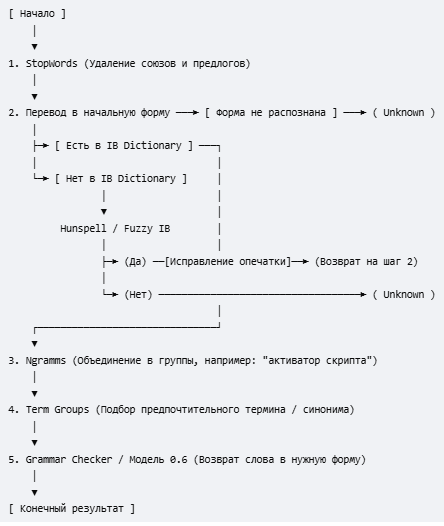

<b>Lexical</b> - не доделан

Сервис должен возвращать исправленное слово
Но пока что он возвращает начальную форму

<b>Как задумывалась схема:</b>

<b>Пояснение:</b>
1 StopWords - Фильтруются стоп-слова (союзы предлоги)
2 Слово переводится в начальную форму и смотрится есть ли оно в IB Dictionary
	Если не распознается начальная форма - Unkwown
	Если нет в dictionary - отдать в hunspell на проверку или проверить нет ли явных опечаток в написании (fuzzy IB). Есть возможность исправить - исправляем и снова переходим к пункту 2 для провторной проверки. Нет возможности исправить - Unknown
	Если есть - Переходим к пункту 3
3 N-gramms - объединяет слова в смысловые группы типа ("активатор скрипта")
4 Term Groups - подбирает точно такие же по смыслу термины. Выбирает предпочтительный
5 Grammar Checker или Модель 0.6 - возвращает измененное слово в нужную форму

Тем самым исправляем ошибки, а для ИБ слов - заменяем жаргонизмы

<b>Что из этого реализовано:</b>
Py сервер на Flask (8081/check) - <a href="check_advisory.py">check_advisory.py</a>
пункт 2 (частично)

Словарь был составлен из Github Advisory Database и содержит пока что только отчеты на английском. 
Поэтому работает не на pymorpy3 а на NLTK (инструмент WordNetLemmatizer)

Слова включенные в словарь лемматизирует отлично (в 99 процентов случаев. встречает случай uses -> us)

<b>Дальнейшая разработка:</b>
Планируется пофиксить все баги с NLTK, подключить НОРМАЛЬНЫЙ словарь ИБ терминов (то что сейчас есть это имитация. там даже нет разделения на иб и не иб), подключить корпуса стоп слов, базы данных чистых слов, интегрировать pymorphy3 (русский язык). Начать работать с hunspell..
С точки зрения продакшена лучше бы так то всю сетевую часть вынести в Go слой

Отчеты из которых составлен словарь лежат в <a href="/domain dict texts/eng/github advisory database/">domain dict texts/eng/github advisory database</a>
Скрипт составляющий из отчетов леммы - <a href="build_dictionary.py">build_dictionary.py</a> - очищает через classifier и делает начальную форму (NLTK)

